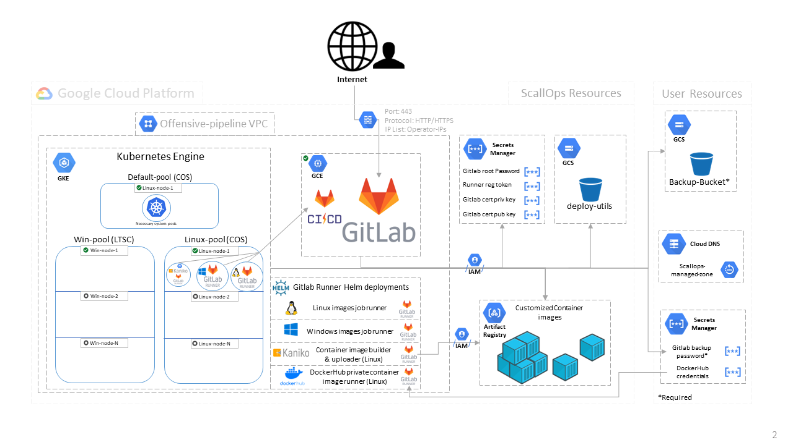

[](https://opensource.org/licenses/MIT)


# SCALLOPS

## Overview

ScallOps is a framework that empowers Red Teams to put more focus on what they need to do, instead of how to do it. 
It utilizes the CI/CD concept to manage and automate the weaponization and deployment of offensive tools.

Security teams and individuals can develop, collaborate and utilize the framework's "Recipes" in order to perform their Red Team tasks with greater efficiency.

You can choose to deploy the framework's infrastructure using the Terraform scripts within this repository or use your own infrastructure.
Refer to the [ScallOps-Recipes](https://github.com/SygniaLabs/ScallOps-Recipes) repository to learn more about the infrasctrucure requirements.

Developed by [@Gil Biton](https://twitter.com/B1t0n_)

<p align="center">
  
</p>

## Infrastructure Features
* All Gitlab's CI/CD features for designning the Recipes.
* Linux & Windows based operating systems for running the Recipes weaponization jobs.
* On-demand automated node scalability (Google Kubernets Engine).
* Access to work with private container images from your Google Container Registry (GCR).
* Ability to supply Docker Hub credentials and work with private container images from your Docker Hub account.
* Capability to automatically build Dockerfiles and push the images to your GCR.
* Automated, weekly Gitlab backup to a desginated bucket.
* Attach external hostname to the framework using Google DNS managed zones.
* Ability to migrate from an older Gitlab instance.

## Deployment

The infrastructure can be deployed to GCP using the provided Terraform scripts.
It is mainly built from a Gitlab instance that provides the CI features and a Kubernetes cluster that execute CI jobs on the relevant operating systems.
There is also a use of Cloud Container Registry to store customized container images that we may use during operating the framework.
Google Cloud Storage is in use to store maintenance scripts and encrypted Gitlab backups.

Automated deployment Pre-requisites:
* Google Cloud subscription with **OWNER** permissions on a project (It is reccomended to use a **clean** GCP project).
* Google Storage Bucket to store the backups. This Bucket is not required to share the same GCP project with the rest of the deployment.
* Access to GCP cloud shell or locally using Terraform with GCP credentials.
* Web Browser.


Clone the repository
```bash
git clone https://github.com/SygniaLabs/ScallOps.git
cd ScallOps
nano config.tfvars
```

Carefully read the instructions related to each variable and act accordingly.

**project_id**, **infra_name** and **backups_bucket_name** variables are required.

The code below is an example for *config.tfvars* file using all available optional variables:
```bash
#### Required ####

project_id = "my-offensive-cicd"              # GCP Project ID
infra_name = "scallops"                       # The name you wish to have as a prefix for the deployment's resources. Must comply with [a-z]([-a-z0-9]*[a-z0-9])
backups_bucket_name = "mycicd-gitlab-backups" # The name of an existing bucket you wish to receive backups to. Terraform will create the required permission to upload the backup archive.


#### Optionals ####
operator_ips = ["1.2.3.4", "22.23.11.12"]     # Office IP / home IPs


## External DNS ##
# Uncomment below 3 lines if wishing to supply external DNS name for accessing Gitalb instance

external_hostname = "scallops.mydomain.com"   # Requires re-deploy of the Gitlab instance to be set as external url from Gitlab's perspective. Will also update Certificate ALT names
dns_project_id = "dns-mgt-company"            # The project ID where the managed DNS zone is located
dns_managed_zone_name = "mydomain-com"        # The configured managed DNS zone name


## Docker hub credentials ##
# An existing secret name storing Dockerhub credentials to fetch private container images (format is username:password or username:access-token).
# Creating Dockerhub access token https://docs.docker.com/docker-hub/access-tokens/
# Creating a secret through GCP secret manager https://cloud.google.com/secret-manager/docs/creating-and-accessing-secrets#create

dockerhub-creds-secret = "dockerhub-private-credentials"     # Name of the secret in secret-manager


## Default deployment values ##
# Uncommenct and modify only if needed (us-central-1 considered to be the cheapest).

# gitlab_instance_protocol = "https"  # The Gitlab instance Web server protocol, http or https.
# zone = "a"                          # Zone for the k8s cluster, Gitlab instance and network.
# region = us-central-1               # Region for the k8s cluster, Gitlab instance and network.


## Migration variables ##
# If you plan on migrating from a different gitlab instance, uncomment all migration variables below, and follow requirements.
# Requires Gsutil on the terraform deployer system as backup will be downloaded locally

migrate_gitlab = true                            ## If performing migration from another Gitlab instance and got a backup file from previous instance. true/false.
migrate_gitlab_version = "14.5.2-ee"             ## The Gitlab full version that you are migrating from e.g. '14.3.3-ee'
migrate_gitlab_backup_bucket = "mycicd-gitlab-backups"              ## The Google Storage Bucket to your Gitlab backup e.g. 'mybucket1-abcd'
migrate_gitlab_backup_path = "backups/gitlab-16451235-backup.zip"   ## The path to the archived backup zip e.g 'backups/gitlab-xxx-backup.zip'
migrate_gitlab_backup_password = "SecretBackupPassword"             ## The password value decrypting the archived backup zip

## ### ### ### ####
```


If using locally, make sure that you are authenticated to your GCP
```bash
gcloud auth list    # List and check currently authenticated account
gcloud auth login   # Authneticate
```


Deploy using terraform while pointing to the created configuration file
```bash
terraform init
terraform apply --var-file=./config.tfvars
```

Once deployed, you should receive the Gitlab instance IP address and the secret name where the password of the Gitlab's root account is stored.

```console
....
kubernetes_secret.k8s_gitlab_cert_secret: Creating...
kubernetes_namespace.sensitive-namespace: Creating...
kubernetes_pod_disruption_budget.konnectivity-agent: Creating...
kubernetes_pod_disruption_budget.kube-dns: Creating...
kubernetes_secret.k8s_gitlab_cert_secret: Creation complete after 1s
kubernetes_pod_disruption_budget.kube-dns: Creation complete after 1s [id=kube-system/k8s-pdb-kube-dns]
kubernetes_pod_disruption_budget.konnectivity-agent: Creation complete after 1s [id=kube-system/k8s-pdb-konnectivity-agent]
kubernetes_namespace.sensitive-namespace: Creation complete after 1s [id=sensitive]
kubernetes_secret.k8s_gitlab_cert_secret-sensitive: Creating...
kubernetes_secret.google-application-credentials: Creating...
helm_release.gitlab-runner-linux: Creating...
kubernetes_secret.google-application-credentials: Creation complete after 1s [id=sensitive/kaniko-secret]
kubernetes_secret.k8s_gitlab_cert_secret-sensitive: Creation complete after 1s
helm_release.gitlab-runner-win: Creating...
helm_release.gitlab-runner-kaniko: Creating...
helm_release.gitlab-runner-linux: Still creating... [10s elapsed]
helm_release.gitlab-runner-linux: Creation complete after 11s [id=linux]
helm_release.gitlab-runner-kaniko: Creation complete after 8s [id=kaniko]
helm_release.gitlab-runner-win: Still creating... [10s elapsed]
helm_release.gitlab-runner-win: Creation complete after 10s [id=windows]


Apply complete! Resources: 63 added, 0 changed, 0 destroyed.

Outputs:

gitlab_ext_ip = "3.4.5.6"
gitlab_root_password_secret = "<infra-name>-gitlab-root-password"
```

[ScallOps-Recipes](https://github.com/SygniaLabs/ScallOps-Recipes) repository should be pre-imported into the Gitlab insatnce together with few instance level CI/CD variables configured. All you have left to do is executing the recipes :)
If you don't see the Recipes repository, you can import it [manually](https://docs.gitlab.com/ee/user/project/import/repo_by_url.html).
> Important! If it is your initial deployment, you must run the deployment's initialization pipeline. 
1. Refer to the imported Recipes repository at /ci/scallops-recipes in your Gitlab instance. 
2. Navigate to CI/CD -> Pipelines -> Run Pipeline.
3. Delete all variables and add 'DEPLOYMENT_INIT' with value 1.
4. Hit 'Run Pipeline' and wait for the initialization process to complete.

## Architecture

The included Terraform scripts will deploy the following resources into your GCP project:
- Compute Engine - Gitlab Instance, managing sources and CI/CD jobs
- Google Kubernetes Engine (GKE) - K8s cluster to host our CI/CD jobs
  - Linux node pool - For the Gitlab-runners pods, and linux related jobs
  - Windows node pool - For Windows related jobs
  - Gitlab-runner Helm packages (Linux-runner, Windows-runner, Kaniko-runner, \[dockerhub-privates-runner\])
- Google Cloud Storage (GCS) - To store maintenance scripts
- Google Container Registry (GCR) - To store cutomized container images
- Service Accounts
  1. Used by Gitlab Compute instance to pull maintenance scripts and store backup
  2. User who is attached to the GKE cluster nodes to pull container images from the project's registry (Read only)
  3. User who is attached to the Kaniko CI job runner allowing to push customized container images to GCR (User has Storage Admin over the default GCR bucket - "artifacts.\<project-id\>.appspot.com" )
- VPC network and related firewall rules to allow operation

<p align="center">
  
</p>


## GCP Cloud Costs

Idle:
* Gitlab Instance: 51.46$ / month (n1-standard-2)
* Linux node: 36.11$ / month (e2-highcpu-2)
* Windows node: 115.70$ / month (e2-highcpu-2)
* Storage (depends on images volume): 100GB - 2$ / month
* Secret manager: 0.06$ /month
* GKE: One Zonal cluster is free per billing account
* **Total: 205$ (us-central-1)** -- [source](https://cloud.google.com/products/calculator/#id=cecbcc81-09b2-4bf6-b4a1-b9019d5b6d23)

Per Job:
* Linux: Same as idle since system already up. When scaled 0.09$ per hour for each running node.
* Windows: Same as idle since one system is already up. When scaled additional 0.03$ for an average compilation job (10 mins).

*Note that Jobs pricing can decrease depending on a simultaneous usage.


## Backup procedure

The deployment requires to supply a GCS bucket name to store the [Gitlab backup](https://docs.gitlab.com/ee/raketasks/backup_restore.html#back-up-gitlab).
Backup occurs every Saturday during 10AM UTC, and is done by the Gitlab compute instance using the *[gitlab_backup.sh](scripts/bash/gitlab_backup.sh)* bash script (Stored on GCS).
The backup archive is encrypted with a password generated by Terrafrom and stored within the secret manager.

The encrypted archive contains the following components:
* Timestamp_yyyy_mm_dd_14.5.2-ee_gitlab_backup.tar (A file containing the Gitlab DB)
* gitlab.rb (The main gitlab configuration file)
* gitlab-secret.json (A file containing keys to decrypt various DB data)
* ssl/hostname.key (SSL certificate private key belonging to the existing hostname)
* ssl/hostname.cer (SSL public certificate file belonging to the existing hostname)

The backup process log is also uploaded to the supplied bucket on every backup.

*Note that this backup structure works with the deployment migration capability.


## Open issues
- Windows related containers are **not** built and deployed automatically to your Container Registry. For now, you will have to do it manually. You can use the supplied [Windows Dockerfiles](https://github.com/SygniaLabs/ScallOps-Recipes/tree/main/_ci-maintain/dockerfiles/windows).
- Windows related containers must include native Powershell Core (PWSH).


## Security Consideration
Altough we made efforts to secure the given permissions and layout of the deployed environment, there may always be a scenario in which someone will achieve some sort of unautohrized access to the internal GCP cloud components. Therefore, it is **highly recommended to use a clean GCP project** when deploying this environment.

## References

CI/CD guides:

* CI/CD concept: https://hackernoon.com/understanding-the-basic-concepts-of-cicd-fw4k32s1
* Gitlab CI docs: https://docs.gitlab.com/ee/ci/
* Gitlab CI Runner K8s executor: https://docs.gitlab.com/runner/executors/kubernetes.html 

Infrastructure references:

* Terraform & Gcloud: https://registry.terraform.io/providers/hashicorp/google/latest/docs 
* GKE: https://cloud.google.com/kubernetes-engine/docs/concepts/kubernetes-engine-overview 
* Container registry access: https://cloud.google.com/container-registry/docs/access-control 
* Helm Charts: https://helm.sh/docs/topics/charts/ 
* Kaniko: https://github.com/GoogleContainerTools/kaniko