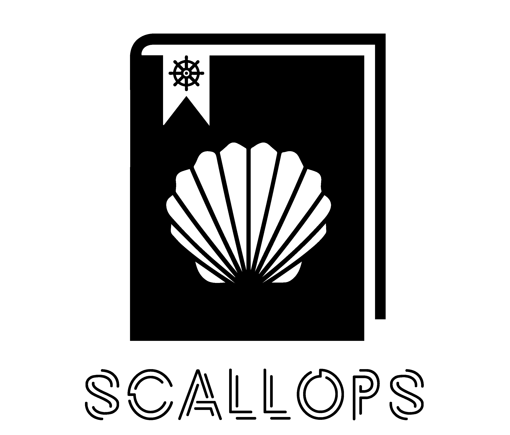

# SCALLOPS

ScallOps is a framework that empowers Red Teams to put more focus on what they need to do, instead of how to do it. 
It utilizes the CI/CD concept to manage and automate the weaponization and attainability of offensive tools.

Security teams and individuals can develop, collaborate and utilize the framework's "Recipes" in order to perform their Red Team tasks with greater efficiency.

<p align="center">
  
</p>


## Architecture

The framework can be deployed to GCP using the provided Terraform scripts.
It is maninly built from a Gitlab instance that provides the CI features and a Kubernetes cluster that execute CI jobs on the relevant operating systems.
We are also using the Cloud Storage to store customized container images that we may use during operating the framework.

<p align="center">
  
</p>


## Deployment

Pre-requisites:
* Google Cloud subscription with <b>OWNER</b> permissions on a project (It is reccomended to use a clean GCP project)
* Access to GCP cloud shell or at least Terraform 14
* Web Browser

After authneticating with your GCloud:
```bash
git clone https://github.com/SygniaLabs/ScallOps.git
cd ScallOps

***Edit config.tfvars according to your needs***

terraform init
terraform apply --var-file=./config.tfvars
```

Once deployed, you should receive the Gitlab instance IP address and the secret name where the password of the Gitlab's root account is stored.

```bash
helm_release.gitlab-runner-linux: Still creating... [40s elapsed]
helm_release.gitlab-runner-linux: Creation complete after 44s [id=linux]
helm_release.gitlab-runner-win: Creating...
helm_release.gitlab-runner-win: Still creating... [10s elapsed]
helm_release.gitlab-runner-win: Still creating... [20s elapsed]
helm_release.gitlab-runner-win: Creation complete after 22s [id=windows]

Apply complete! Resources: 50 added, 0 changed, 0 destroyed.

Outputs:

gitlab_ext_ip = "1.2.3.4"
gitlab_root_password_secret = "<INFRA_NAME>-gitlab-root-password"
```

[ScallOps-Recipes](https://github.com/SygniaLabs/ScallOps-Recipes) repository should be pre-imported into the Gitlab insatnce together with all the relevant variables configured. All you have left to do is [designing](https://github.com/SygniaLabs/ScallOps-Recipes#designing-recipes) your recipes :)
If you don't see it, you can import it [manually](https://docs.gitlab.com/ee/user/project/import/repo_by_url.html).


## Features
Can be used by triggering ScallOps-Recipes repository.
- Tools import (See security considerations)
- Container build and push (See security considerations)
- Multi pipeline trigger

Tool weaponization currently supports:
- C# compiling
- GO compiling
- GO compiler and obfuscator
- ConfuseEX obfuscation
- Chimera Obfuscation
- PwnDrop deployer

Tool collection:
- [Rubeus](https://github.com/GhostPack/Rubeus.git) 
- [SharpHound3](https://github.com/BloodHoundAD/SharpHound3.git) 
- [Seatbelt](https://github.com/GhostPack/Seatbelt.git) 
- [SharpDPAPI](https://github.com/GhostPack/SharpDPAPI.git) 
- [SharpWMI](https://github.com/GhostPack/SharpWMI.git) 
- [PowerUp](https://github.com/HarmJ0y/PowerUp.git) 
- [Inveigh](https://github.com/Kevin-Robertson/Inveigh.git) 
- [pingcastle](https://github.com/vletoux/pingcastle.git) 
- [DomainPasswordSpray](https://github.com/dafthack/DomainPasswordSpray.git) 
- [PrintNightmare](https://github.com/cube0x0/CVE-2021-1675.git) 
- [PowerUpSQL](https://github.com/NetSPI/PowerUpSQL.git) 
- [goddi](https://github.com/NetSPI/goddi.git) 
- [gowitness](https://github.com/sensepost/gowitness.git) 
- [SharpEDRChecker](https://github.com/PwnDexter/SharpEDRChecker.git) 


## How to develop Recipes

Refer to the [ScallOps-Recipes](https://github.com/SygniaLabs/ScallOps-Recipes#designing-recipes) repository to learn more.

## GCP cloud costs

Idle:
* Gitlab Instance: 51.46$ / month
* Linux node: 24.46$ / month
* Storage (depends on images volume): 100GB - 2$ / month
* Secret manager: 0.06$ /month
* GKE: One Zonal cluster is free per billing account
* <b>Total: 78$ (us-central-1)</b> -- [source](https://cloud.google.com/products/calculator/#id=8cb8ce23-5ff1-4e7a-a3b4-da2df464bfff)

Per Job:
* Linux: Same as idle since system already up. When scaled 0.09$ per hour for each running node.
* Windows: ~0.12$ on the first job (30 mins), and additional 0.006 for an average build job (2 mins).

*Note that jobs which are executed simultaneously, can use the same node resources, resulting them in using the same credit. 


## Open issues
- Currently, Gitlab runner does not support running jobs on Windows K8s cluster nodes. 
  You can follow the below workaround to still utilize it:
  - Any Windows related container that you are executing your job on, must include Powershell Core (Pwsh has to be avaialble for command line)
  - To fetch previous jobs artifacts and upload outputs to the job artifact, you may utilize the API token from env variables and gitlab-runner-helper.exe binary that is stored in the cicd-utils bucket.

- Deployment does not support the use of your own purchased domain, It currently utilizes a self-signed certificate. Don't try to change the domain, as it may break the certificate trust by the runners. This issue will be solved soon.

- Windows related containers are <u>not</u> built and deployed automatically to your Container Registry. For now, you will have to do it manually. You can use the supplied [Windows Dockerfiles](https://github.com/SygniaLabs/ScallOps-Recipes/_ci-maintain/dockerfiles/windows).


## Security Considerations

To make the deployment and usage of this framework as smooth as possible, the following configurations were made:

1. Gitlab's instance CI/CD variable that holds the API key of the root account. This means that any user that you will onboard to the Gitlab, will be able to design and trigger CI pipeline, extract this API key and further use it.

However, keep in mind that having the API token available to any repository CI pipeline enables you to:
- Operate with an open [issue](https://gitlab.com/gitlab-org/gitlab-runner/-/issues/4014) workaround when fetching previous artifcats.
- Utilize the automatic tool repository importer from the <b>.tools-index.json</b> file. (You may set the varialbe on the ScallOps-Recipes repository only, and refrain from this risk by protecting the variable).


2. See [Container-Builder](https://github.com/SygniaLabs/ScallOps-Recipes/_ci-maintain/dockerfiles/README.md) for GCP storage related security consideration.

<u>The bottom line:</u> any registered user on your Gitlab instance will have complete access to your Project's Cloud Storage and Gitlab API.

Don't like these risks? You can waive the Tools Importer and Container Builder features by:
1. Login with your root account and follow the [instructions](https://docs.gitlab.com/ee/user/profile/personal_access_tokens.html#revoke-a-personal-access-token) to revoke the post-deployment personal access token.
2. Browse to your GCP console, navigte to IAM & Admin -> Service Accounts -> Disable a service account with the convention: **\<INFRA-NAME\>-gke-buckt@<PROJECT_ID>.iam.gserviceaccount.com**. This account was created with permissions to push and pull containers.


## References

CI/CD guides:

* CI/CD concept: https://hackernoon.com/understanding-the-basic-concepts-of-cicd-fw4k32s1

* Gitlab CI docs: https://docs.gitlab.com/ee/ci/

* Gitlab CI Runner K8s executor: https://docs.gitlab.com/runner/executors/kubernetes.html 

Infrastructure references:

* Terraform & Gcloud: https://registry.terraform.io/providers/hashicorp/google/latest/docs 
* GKE: https://cloud.google.com/kubernetes-engine/docs/concepts/kubernetes-engine-overview 
* Container registry access: https://cloud.google.com/container-registry/docs/access-control 
* Helm Charts: https://helm.sh/docs/topics/charts/ 
* Kaniko: https://github.com/GoogleContainerTools/kaniko 

Issues:

* K8s windows exec support: https://gitlab.com/gitlab-org/gitlab-runner/-/issues/4014 
